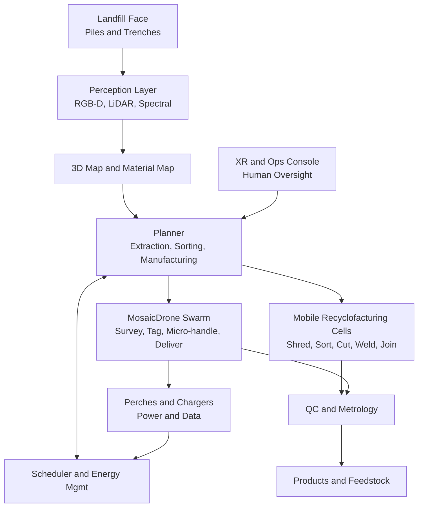
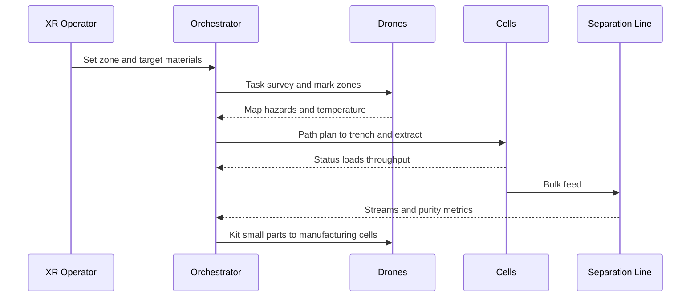
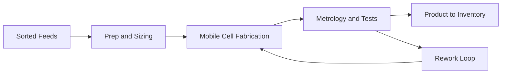

# MosaicDrone for Landfill Mining and Swarm Manufacturing

Turning waste mountains into materials and products with hybrid aerial-ground swarms, perception-driven sorting, and recyclofacturing cells.

---

## Vision

Use MosaicDrone’s modular, omnidirectional, self-assembling swarm as a logistics, sensing, and fixturing layer over landfill and brownfield sites. Drones coordinate with ground robotics and mobile recyclofacturing cells to identify, extract, sort, and repurpose materials into usable products on or near site.

Key ideas
- Persistent aerial voxel field for mapping, guiding, and micro-handling
- Mobile cells for shredding, sorting, cutting, welding, and joining
- XR-guided human-in-the-loop for safety and high-value decisions
- Energy-aware operations with perches, solar microgrids, and battery swaps

---

## System architecture

Roles
- Drones: survey and thermal checks, marking, light pick-and-place, sample delivery, safety beacons, temporary jigs
- Cells: ground robots and conveyors for bulk handling, sorting, shredding, joining and product formation
- XR: focuses attention, validates uncertainties, provides ergonomic guidance for human operators

---

## Operational concept

1. Scan and segment: build a layered 3D map with material likelihoods (plastics, ferrous, non-ferrous, organics)
2. Plan extraction: select regions and safe dig paths; schedule drones for marking and cells for excavation
3. Sort and kit: conveyor and separation (magnetic, eddy, density, optical); drones kit small parts for cells
4. Recyclofacture: convert sorted feeds into products or subassemblies with on-site cells
5. QC and inventory: metrology, tagging, storage; feedback improves future planning

---

## Workflows

### Extraction and sorting

### On-site manufacturing and QC

---

## Safety and environment
- Geo-fenced airspace, dust and fume aware flight; prop wash limits near fine particulates
- Thermal and gas monitoring for methane hotspots; no-fly zones updated in real time
- Redundant comms; line-of-sight and perimeter observers; E-stop trees shared across devices
- Waste leachate and runoff management integrated with site ops

---

## Energy strategy
- Perches on masts and mobile trailers; solar and battery banks; generator fallback
- Energy-aware scheduling to maintain aerial coverage with minimal idle
- Swappable packs for drones; DC rails for cells; localized conversion

---

## Metrics
- Mapping coverage and update rate; material classification precision/recall
- Extraction throughput (t/h); sorting purity; contamination rate
- Product yield; cost per kg processed; energy per kg
- Safety incidents (zero target); gas and dust compliance; uptime of aerial coverage

---

## Roadmap
1. Pilot at controlled waste yard: aerial mapping + small-parts kitting to a single cell
2. Add mobile perches and two-stage separation line; drone-assisted QC
3. Introduce on-site product lines (panels, brackets, pallets) from sorted metals/plastics
4. Scale to multi-cell operation with continuous aerial coverage and night ops

---

## Integration with MosaicDrone
- Reuse voxel swarm for marking, fixturing, and logistics
- Extend docking for rugged perches and quick-clean interfaces
- Use recyclofacturing proposal patterns for manufacturing cells and XR guidance

Contributions and collaborations welcome. This document is a living plan; propose changes via PRs.
