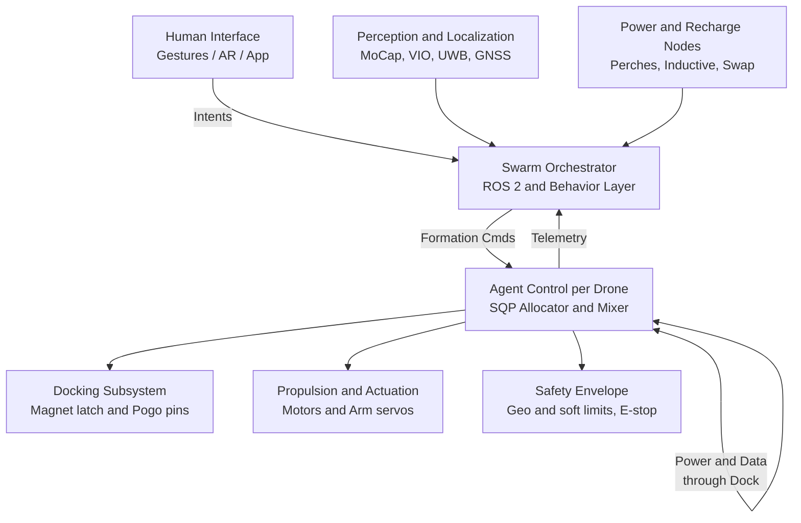
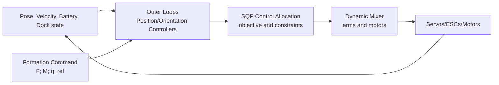
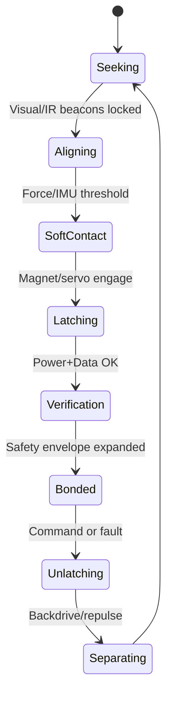
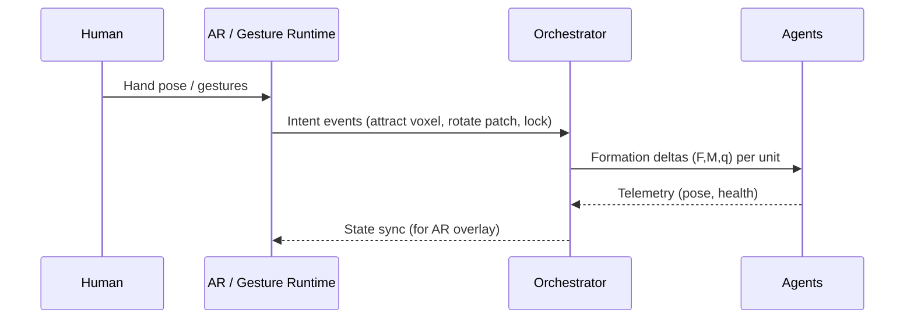
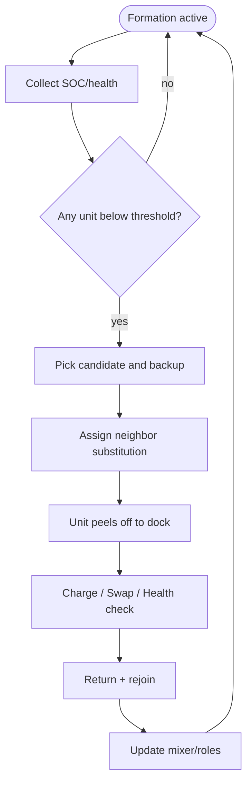

# MosaicDrone

Programmable aerial voxels — a modular, omnidirectional, self‑assembling drone swarm you can sculpt with gestures. “Air Legos” for research, art, and adaptive infrastructure.

—

## Technical Overview

MosaicDrone implements aerial voxels using modular drones that dock mid-air to form larger structures. Individual units handle omnidirectional flight, power/data sharing through docking connectors, and autonomous recharge rotation to maintain persistent formations.

### MOSAIC, defined
- **M**odular: Standardized mechanical, electrical, and software interfaces across units and payloads
- **O**mnidirectional: True 6‑DOF control (decoupled translation/rotation) for precise assembly in any orientation
- **S**elf‑Assembling: Reliable mid‑air docking, structure growth/shrink, and automated reconfiguration
- **A**utonomous: Distributed planning, fault tolerance, and continuous operation without centralized bottlenecks
- **I**ntelligent: Learning‑ready stack for perception, scheduling, and human‑swarm interaction
- **C**raft/Collective: Each unit is a craft; together, they behave as a single meta‑craft

### Applications
- **Robotic research**: Fully‑actuated flight, docking, allocation, and swarm controls testbed
- **Adaptive structures**: Reconfigurable sensor/antenna arrays, temporary installations
- **Human‑robot interaction**: Gesture‑controlled formations with <80 ms latency targets

—

## Core Capabilities (initial goals)
- **Omnidirectional unit flight** via MOMAV‑style actuation and control allocation
- **Mid‑air docking** with standardized, orientation‑agnostic connectors (mechanical + power + data)
- **Aggregate control** that reconfigures mixers when drones attach/detach (formation behaves as one object)
- **Low‑noise operation** with prop design, ESC tuning, and structural damping
- **Human‑in‑the‑loop** interaction via gestures/AR with sub‑80 ms end‑to‑end latency targets
- **Persistent uptime** through autonomous recharge/battery‑swap scheduling and voxel substitution

—

## System Architecture (overview)



Components
- **Human Interface**: Gestures (MediaPipe/AR), voice/app; mapped to high‑level formation edits
- **Swarm Orchestrator**: ROS 2 nodes for formation planning, tasking, time sync, collision envelopes
- **Agent Control (per drone)**: SQP allocator for 6‑DOF; mixer reconfiguration; health reporting
- **Perception/Localization**: Indoor (MoCap/UWB/VIO/Aruco), outdoor (GNSS+RTK/VIO/SfM)
- **Docking Subsystem**: Mechanical latch + electromagnets; alignment cones; pogo pins for power/data
- **Propulsion & Actuation**: Motors, ESCs (48–96 kHz PWM), rotating arm servos (MOMAV‑style)
- **Safety**: Hard E‑stop, geofences, soft constraints in optimizer, fail‑safe descent, link watchdogs
- **Power & Recharge**: Perches/inductive/battery swap; scheduling to keep the voxel field persistent

—

## MOMAV foundation and control allocation

MosaicDrone builds on the MOMAV research (Marco’s Omnidirectional Micro Aerial Vehicle): a fully actuated multirotor with rotating arms arranged in a highly symmetric 3D geometry (e.g., octahedral) that decouples translation and rotation. We adapt its ideas for modular swarms and docking.

Key takeaways from MOMAV
- **Geometry**: Arms aligned to vertices of a 3D solid (e.g., octahedron); high efficiency across orientations
- **Actuation**: Rotating arms with continuous rotation via slip‑rings; modified hobby servos; precise control
- **Allocation**: SQP‑based control allocation tunes objectives (e.g., throttle effort, arm‑velocity limits)
- **Outcome**: Accurate 6‑DOF control; robust to angle singularities via objective penalties

References
- Manuscript: [MOMAV manuscript (PDF)](https://marcoruggia.ch/home?projects%20momav)
- Codebase: [mruggia/momav](https://github.com/mruggia/momav)

### Control stack (per agent)



SQP objective (conceptual)
- Minimize throttle effort and arm‑angle velocities
- Penalize throttle/velocity bounds smoothly (quadratic penalties)
- Enforce wrench constraints to match desired force/torque

Docking‑aware reconfiguration
- When drones dock, the “actuator set” becomes the union of attached modules
- The mixer matrix and allocator constraints update online (actuator geometry, torque axes)
- Constraints add dock loads and safety margins; objectives may prioritize low arm velocity near latches

—

## Docking: mechanical, electrical, and data

Mechanics
- Alignment geometry (chamfered cones/pins, guide rails)
- Primary latch: spring‑loaded or magnetic clamp; backup retention
- Compliance layer for misalignment tolerance

Power/Data
- Pogo‑pin arrays for DC bus + CAN/ethernet‑over‑flex
- Optional inductive pads for quick‑attach charging perches
- Brownout‑safe handover (soft‑start, inrush limiting, hot‑plug detection)

Slip‑ring insight from MOMAV
- Place slip‑rings on the DC side (battery→ESC) to reduce losses vs. ESC→motor side
- Benefit: lower current density across rings at equivalent thrust → improved efficiency and thermal headroom

Docking state machine



—

## Swarm behaviors and interaction

Formation control
- Lattice/topology planner (grid, shell, ring, helical, text meshes)
- Role assignment: voxel IDs, redundancy slots for hot‑swap during recharge
- Collision envelopes and keep‑out zones (humans, structures, no‑fly regions)

Gesture → formation pipeline



—

## Energy, uptime, and logistics

Objectives
- Maintain target voxel count in formation despite recharge cycles
- Schedule per‑unit departures/returns with minimal shape disruption
- Prioritize low‑SOC units and redistribute load to neighbors

Recharge rotation flow



Power options
- Rooftop perches with magnetic alignment and pogo‑pin pads
- Inductive landing pads for fast attach/detach
- Swappable battery sleds (human‑assisted for MVP)

—

## Acoustic design (low‑noise flight)
- Larger, slower props reduce tip vortex noise; test tri‑/quad‑blade profiles
- Serrated/finlet trailing edges and toroidal props to shift/disperse tonal peaks
- ESC PWM 48–96 kHz to move switching noise out of band
- Vibration isolation on motors/arms; foam‑lined structural damping
- Smooth trajectory and allocator penalties to limit throttle slew

—

## Perception and localization
- Indoor MVP: OptiTrack/Vicon or UWB for ground truth; AprilTags for docking alignment
- Outdoor: GNSS RTK + VIO; visual beacons on docks; cross‑checking with inter‑agent ranging
- Time sync: PTP/Chrony or ROS 2 time; synchronized control horizons for formation moves

—

## Repository layout

*Current structure (docs, specs, and design assets in place; `core/`, `modules/`, `swarm/`, `firmware/` are planned).*

```text
MosaicDrone/
├── cells/                     # Toolheads, mobile cells, recipes
├── docs/                      # All technical docs — start at docs/README.md
│   ├── README.md              # Doc index and folder layout
│   ├── subsystems/INDEX.md    # Subsystem status and gaps
│   └── ...                    # Specs by area (airframe, control, docking, etc.)
├── economics/                 # Unit models, market analysis, validation
├── hardware/
│   ├── CAD/                   # Frames, docks, jigs (STEP/STL, parametric)
│   └── BOM/                   # Bills of materials
├── lca/                       # Life-cycle and sustainability model
├── process/                   # Manufacturing and process docs
├── simulations/               # Isaac Lab, training, environments
├── LICENSE
└── README.md
```

## Documentation

All technical specs and subsystem docs live in **docs/**. Use it as the single entry point.

| Where to go | Link |
|-------------|------|
| **Documentation index** (specs, layout, links) | [docs/README.md](docs/README.md) |
| **Subsystems status** (have / missing / next per subsystem) | [docs/subsystems/INDEX.md](docs/subsystems/INDEX.md) |
| **Safety & operations** | [docs/safety/safety_case.md](docs/safety/safety_case.md), [docs/safety/ops.md](docs/safety/ops.md) |
| **Proposals & research** (root) | [Recyclofacturing](Recyclofacturing-Proposal.md), [Landfill](README.landfill-mining.md), [Thesis](THESIS.landfill-mining.md), [Roadmap](STRATEGIC_UPGRADE_ROADMAP.md) |

—

## Getting started (MVP, indoor)

Prerequisites
- ROS 2 Humble or newer; colcon; Python 3.10+
- MoCap or UWB localization; joystick or gesture camera
- At least 4 drones (dev platforms or mini‑MOMAV units)

Build
```bash
# WIP scaffolding (example commands)
git clone https://github.com/Caerii/MosaicDrone
cd MosaicDrone && colcon build
source install/setup.bash
```

Run (simulation)
```bash
ros2 launch simulations/gazebo mosaic_swarm.launch.py world:=indoor_arena
```

Run (demo: gesture → lattice)
```bash
ros2 launch swarm/interaction gesture_to_formation.launch.py formation:=cube_2m
```

—

## Roadmap
1. MVP indoor lattice with 4–8 units (MoCap/UWB, manual battery swap)
2. Reliable mid‑air docking + pogo‑pin power/data; safety envelopes
3. Dynamic mixer reconfiguration for bonded aggregates
4. Recharge perches and autonomous rotation scheduling
5. Low‑noise blades + ESC tuning package
6. Outdoor pilot with RTK + VIO and safe distances
7. Open choreography/gesture API and AR overlays

—

## Contributing

We welcome contributions across hardware, control, perception, UX, and ethics:
- Open issues with clear reproduction steps and logs
- Propose designs in `hardware/CAD` with parametric sources
- Add simulations and tests for new behaviors and allocators
- Discuss safety, airspace, and community impact in `docs/`

Before proposing flight‑critical changes, see [Subsystems index](docs/subsystems/INDEX.md) and [Safety](docs/safety/safety_case.md) / [Operations](docs/safety/ops.md).

—

## License

Open hardware and software licensing under consideration. Common options:
- Software: MIT/Apache‑2.0/GPL‑3.0
- Hardware: CERN‑OHL‑S/W/P v2

Until finalized, this repository defaults to the included `LICENSE` file. If you wish to use or deploy MosaicDrone commercially, please open an issue to coordinate.

—

## Acknowledgements and references
- MOMAV research by Marco Ruggia: [GitHub](https://github.com/mruggia/momav) · [Overview](https://marcoruggia.ch/home?projects%20momav)
- ETH Zürich omnidirectional platforms (e.g., Voliro): [Voliro publications](https://voliro.com/research)
- Lynchpin geometry inspiration for modular docking: [SAE paper](https://www.sae.org/publications)
- Acoustic research on low‑noise propellers and toroidal blades (various)

If you build on MosaicDrone, please cite and share your results.
