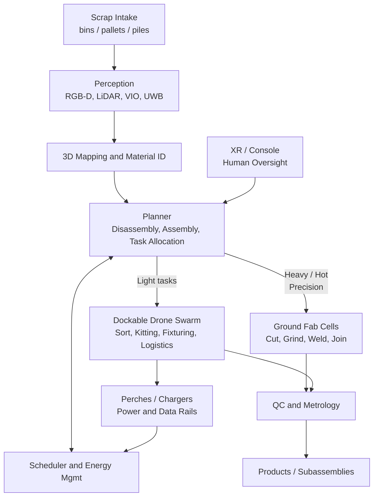
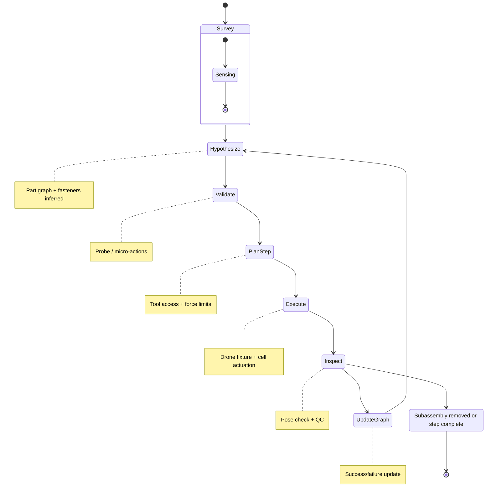
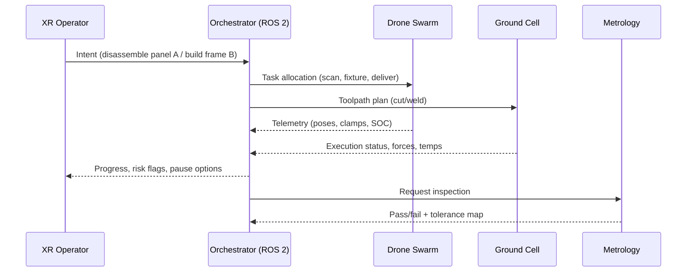

# MosaicDrone Recyclofacturing Proposal

Transforming scrap into products via hybrid aerial-ground orchestration, XR-guided workflows, and learning-enabled CAD.

---

## Executive summary

We propose extending MosaicDrone — an open, modular, omnidirectional, self-assembling swarm ("air voxels") — into a recyclofacturing platform. Drones handle perception, light manipulation, fixturing, logistics, and human-in-the-loop interaction. Anchored/perched drones and ground robotic cells execute high-force, hot, or precision operations (cutting, grinding, welding). The system targets safe, continuous, XR-supervised product creation from scrap.

---

## Objectives
- Autonomous scrap mapping, classification, and part pose estimation
- Disassembly sequence planning under uncertainty; safe tool access
- Hybrid manipulation: drones (sort/fixture/transport) + ground cells (cut/weld/join)
- AI-enabled CAD: scrap-to-CAD reconstruction, inverse design constrained by available stock
- XR guidance for human oversight, inspection, and cooperative assembly
- Continuous operations: energy rotation, fault tolerance, and QC loops

---

## System architecture

Roles
- Drones: multi-view sensing, pick-place of small ferrous items (EM grippers), fixturing/jigs (dock-in-place clamps), part delivery, illumination/marking.
- Perched drones: become rigid actuators/tools via rails (power/data), e.g., screwdriver, riveter, chalk/paint marker, inspection borescope.
- Ground cells: gantry/arm robots for cutting, grinding, welding, and high-precision joins.
- XR: task intent, path confirmation, safety envelopes, teach-by-demonstration.

---

## MOSAIC adaptations
- Perch-and-Work: standard rails with magnetic alignment and pogo pins; tethered power for tools; EMI/thermal hardening near hot work.
- Docking mechanics: alignment cones/pins + latch; compliance layer; hot-plug detection (inrush limiting).
- Allocation & safety: SQP objectives penalize prop wash near fumes, limit arm velocities near latches; geofences; E-stop and watchdogs.
- Perception: multi-view fusion, material cues (magnetic response, specular spectra), fastener detection (learned keypoints).
- Logistics: energy-aware scheduling; redundancy slots in formations to maintain fixtures during drone swaps.

---

## Disassembly & assembly workflows

---

## Learning stack (aligned with TARS focus)
- AI-enabled CAD (a):
  - Scrap-to-CAD: neural SDF -> B-Rep reconstruction; component graph segmentation
  - Inverse design via diffusion/transformers constrained by available stock
  - Fixture/jig synthesis for access/tolerance; differentiable objectives (weld access, clamp reach)
- XR guidance (b):
  - Overlays for cut lines, fasteners, seam paths, tolerance bands; uncertainty visualization
  - Shared autonomy: human selects intent, system optimizes path; skill capture & replay
- HRI for weld/assembly (c):
  - Cooperative manipulation: drones hold/align; human/robot welds
  - Hierarchical RL + imitation for sequence policies; failure recovery and replanning

---

## Interaction & control sequences

---

## Safety & compliance
- Thermal/fume zones; adaptive prop wash limits; airflow management
- EMI shielding near welders; cable/tether routing; lockout/tagout integration
- Sharp-edge handling, sling/snag risk mitigation; autonomous path veto in proximity
- Hard E-stop, soft stops (trajectory freezing), watchdog reset, safe descent
- Data logging for traceability (forces, temps, video, weld parameters)

---

## Phased roadmap
1. Sorting & kitting: drones map/classify scrap; EM pick small ferrous; bin packing; XR validation
2. Fixturing: docked drones act as clamps/locators; ground robot performs cut/weld; AR seam cues
3. Assisted disassembly: perch-mounted drivers remove accessible fasteners; drones stabilize/hold
4. Semi-automated assembly: inverse-designed frames from stock; drones jig; ground robot joins
5. Continuous cell: energy-aware scheduling, QC loops, fault-tolerant ops; shift to outdoor-rated cells

---

## Early demos
- EM pick-and-place kits with XR overlays and confidence heatmaps
- Drone-docked jig holding two plates; human/robot weld following AR seam
- Learned screw removal on lightly torqued fasteners with perch-mounted driver
- Scrap art assembly with rivets/bolts; drone fixturing, ground fastening, AR guidance

---

## Metrics
- Perception: identification precision/recall; pose error (mm/deg)
- Process: success rate per step; mean time; energy per kg processed
- Quality: tolerance pass rate; rework rate; structural tests
- Safety: incident rate (zero target); fume/thermal compliance; EMI robustness
- Uptime: formation availability during energy rotation; dock turnaround time

---

## Risks & mitigations
- Heat/spatter -> standoff, shields, anchored tools, dedicated airflow
- EMI -> shielding, filtered rails, fiber data where feasible
- Power limits -> tethered rails, high-voltage DC bus with local conversion
- Scrap variability -> uncertainty-aware planning, probe actions, human-in-loop checkpoints

---

## Teaming & references
- Alignment with TARS areas: (a) AI-CAD, (b) XR guidance, (c) HRI for weld/assembly
- MOMAV foundation for fully actuated flight and SQP allocation
- Related work: omnidirectional drones (ETH/Voliro), Lynchpin modular geometry, low-noise prop research
- Grants & venues: NSF FMRG, ICRA, RSS, CVPR, NeurIPS (perception/control), IEEE VR/RO-MAN (HRI/XR)

If you are interested in collaboration or deployment pilots, please open an issue or contact the maintainers. Together, we can turn waste streams into products through safe, intelligent, and beautiful hybrid aerial-ground fabrication.
