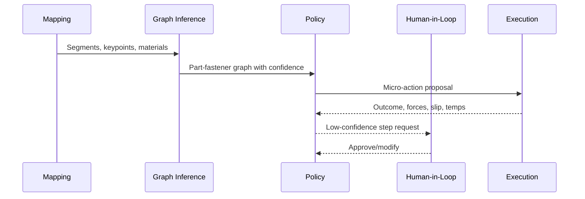
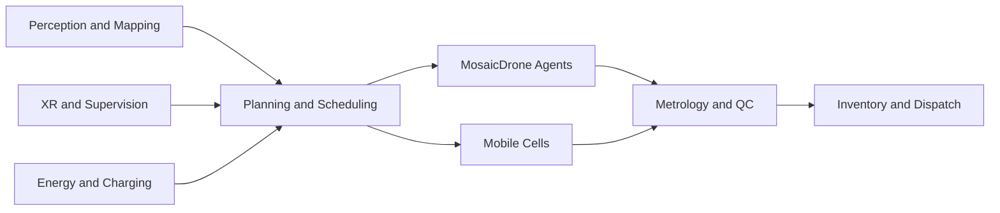

# MosaicDrone Thesis: Landfill Mining and Swarm Manufacturing

A systems thesis on turning waste ecologies into supply chains via hybrid aerial-ground robotics, perception-driven sorting, and distributed recyclofacturing.

---

## 1. Motivation and scope

Landfills are diffuse mines: multi-decade deposits of metals, plastics, glass, and organics, concentrated by human activity but diluted by time and contamination. Traditional remediation is costly, dangerous, and logistics-heavy. This thesis explores a robotics-native alternative: orchestrated swarms of modular drones and mobile fabrication cells that continuously prospect, extract, sort, and remanufacture materials in situ.

MosaicDrone provides the aerial voxel layer: sensing, marking, micro-handling, fixturing, and logistics. Ground cells deliver bulk force, heat, and precision (cutting, grinding, welding, joining, printing). Together, they form a distributed factory that can move with the waste front.

---

## 2. Material streams and processes

Typical streams and candidate processes:
- Ferrous metals (steel, iron): magnetic separation; cutting (oxy/plasma/abrasive); welding (MIG/TIG/spot); additive (wire arc additive manufacturing – WAAM)
- Non-ferrous (aluminum, copper, brass): eddy current and optical sorting; cutting (plasma/waterjet); welding/brazing; WAAM variants; cold spray
- Plastics (PET, HDPE, PP, PS, PVC): NIR sorting; shredding; melt filtration; extrusion; pelletizing; FFF/LDM printing; sheet and thermoform
- Glass/ceramics: crushing, grading, geopolymer binders, aggregate; sintering and glass fusing
- Organics/soil: composting, biochar, stabilization; not core to structural products but relevant for remediation

Contamination management: moisture, soil, coatings, biofilms. Use staged preprocessing: wash, abrasive/tumble, thermal strip (controlled), with emissions management.

---

## 3. Aerial-ground division of labor

- Drones (MosaicDrone):
  - Sensing: multi-view RGB-D/LiDAR, thermal, spectral sampling
  - Light manipulation: EM micro-grippers for ferrous, clamp and tag placement, small kit delivery
  - Fixturing: dock and act as clamps/locators for alignment and tacking
  - Guidance: project/LED mark cuts; AR anchors; safety beacons; surveying
  - Logistics: last-meter delivery from separation lines to fab cells
- Ground cells:
  - Bulk handling: excavation, conveyorized feed, shredding, screens
  - Separation: magnetic, eddy current, density, optical (NIR)
  - Fabrication: cutting, forming, welding, bolting/riveting, additive (WAAM/FFF/cold spray)
  - Metrology: 3D scanning, NDT (ultrasound/dye), mechanical tests

---

## 4. Manufacturing modalities

### 4.1 Metal additive (WAAM / cold spray)
- Inputs: cleaned wire (steel, aluminum), or wire drawn from recycled stock; for cold spray, powdered feedstock from shred and sieve
- Benefits: high deposition rates, large-format parts, on-site fixtures
- Challenges: heat management, porosity, shielding gas logistics, energy intensity
- Drone role: jigging, inter-pass inspection, temperature mapping, lead-time reduction by pre-placing inserts

### 4.2 Polymer additive (FFF / pellet extrusion)
- Inputs: shredded, washed, sorted plastics; pelletized blends; compatibilizers
- Benefits: enclosure panels, pallets, ducts, spacers; on-site large-format printing
- Challenges: property variability, moisture, emissions; annealing and reinforcement (fibers)
- Drone role: spool/pellet logistics, print monitoring, brim/clamp assistance, post-process trimming assist

### 4.3 Welding and joining
- Processes: MIG/TIG, spot, friction stir (aluminum), brazing, mechanical fastening (bolts, rivets)
- Drone role: positional fixturing while ground robot welds; light tacking via docked toolheads where safe; shield and fume extraction alignment

### 4.4 Subtractive and forming
- Processes: plasma, abrasive waterjet (containerized), shear and press brake (mobile), drilling
- Drone role: cut-line marking, cooling spray guidance, chip/debris surveillance and exclusion

---

## 5. Disassembly science

Unknown assemblies demand hypothesis-driven disassembly:
- Graph inference: from scans to part-fasteners-contact graph; learned priors for consumer goods and appliances
- Micro-actions: probing, fastener classification (slot, Phillips, Torx), torque estimation
- Policy: hierarchical RL and imitation for step selection; uncertainty gating to human/XR checkpoints
- Tooling: perch-mounted drivers and nibblers for light operations; escalation to cell when torque/heat exceed limits

---

## 6. Energy, emissions, and life-cycle analysis (LCA)

- Energy budgeting: aerial coverage vs. cell duty cycles; renewables priority; generator fallback
- Emissions: welding fumes, VOCs from plastics, dust; capture and filtration per cell; drone prop wash policies
- LCA framing: system boundary (site-internal); avoided virgin material extraction and transport; credits for remediation
- Metrics: kWh per kg processed; CO2e per kg; recovery yield; product durability indices

---

## 7. Economics and logistics

- Unit economics: CAPEX (cells, drones, perches), OPEX (energy, consumables, maintenance), labor (XR ops)
- Throughput: t/h by stream; uptime targets; night operations with light towers and beacons
- Products: site furniture, brackets, pallets, sheet goods, structural members—matched to local demand
- Market coupling: municipal procurement, remediation credits, extended producer responsibility (EPR) synergies

---

## 8. Risk and safety engineering

- Thermal/gas hazards: methane pockets, self-heating; continuous sensing; hot work permits integrated in planner
- Dust explosions: classification of zones; prop wash minimization; misting; housekeeping protocols
- EMI: welding interference; shielding and fiber data links on rails; watchdogs and E-stop trees
- Human safety: exclusion zones, line-of-sight supervisors, PPE compliance via XR prompts

---

## 9. System orchestration

Scheduler objectives
- Maximize recovery yield at purity constraints
- Minimize energy per kg and travel idle
- Maintain aerial coverage for safety and guidance
- Respect hard safety constraints and environmental limits

---

## 10. Roadmap and pilots

1. Controlled yard: mapping + EM micro-pick kits feeding one cell; XR validation
2. Separation line + two cells: metal and polymer; drone fixturing and QC
3. Productization: standard SKUs (panels, brackets) with WAAM and FFF; field installs
4. Scale-out: multi-cell, continuous ops, night shifts; integration with municipal programs

---

## 11. Open questions and research agenda

- Robust scrap-to-CAD pipelines; uncertainty quantification and active learning
- Standardized drone-perch tool interfaces for safe light operations
- Adaptive process control for variable recycled feedstock (metals and plastics)
- Ethics and governance for landfill airspace and public engagement

---

## 12. References and related work

- MOMAV omnidirectional control and SQP allocation
- Voliro and omnidirectional aerial manipulation platforms
- WAAM and cold spray metal additive for large-format, recycled feedstock
- Polymer recycling for FFF: blends, compatibilizers, emissions
- Landfill mining literature: environmental, economic, and social impacts

This thesis proposes MosaicDrone as the spatial operating system for landfill mining: a persistent, intelligent, safe, and open platform that binds sensing to making, and turns waste into lasting value.
