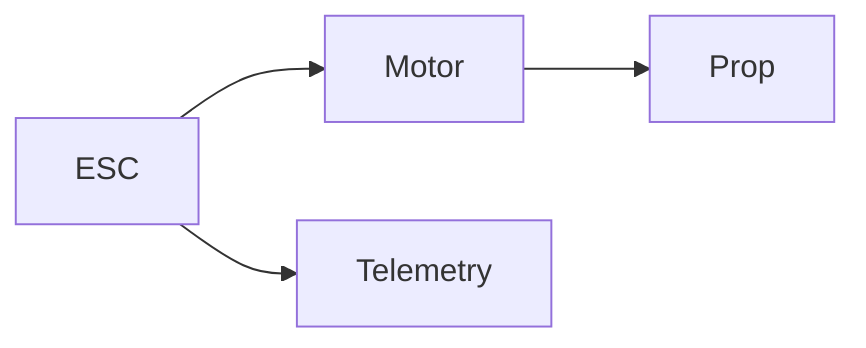

# Propulsion Module Spec

## Purpose
Provide thrust and control authority with low noise and high efficiency.

## Scope
Motors, props, ESCs, isolation, guards/ducts.

## Functional requirements
- Hover thrust per unit: ≥ 2× unit weight margin across orientations
- Dynamic response: 10–90% step < 150 ms
- Efficiency maps: thrust/W across RPM bands

## Noise targets
- See `docs/acoustics/noise_package.md` for SPL and psychoacoustic limits

## Non-functional requirements
- IP54; maintainability; cost targets

## Interfaces
- Mechanical: mount pattern, guard/duct options
- Electrical: ESC supply 24 V; PWM/DSHOT; telemetry (RPM, current, voltage, temp)
- Data: ESC telemetry via UART/CAN

## Diagrams

## Acceptance tests
- Thrust curves; ESC profiles 48–96 kHz; SPL bands; vibration spectrum

## Risks
- Tonal noise; vibration; blade erosion; ingress

## Open questions
- Serrated vs toroidal props; ducts vs guards tradeoffs

## Versioning
- v0.2 detailed spec
