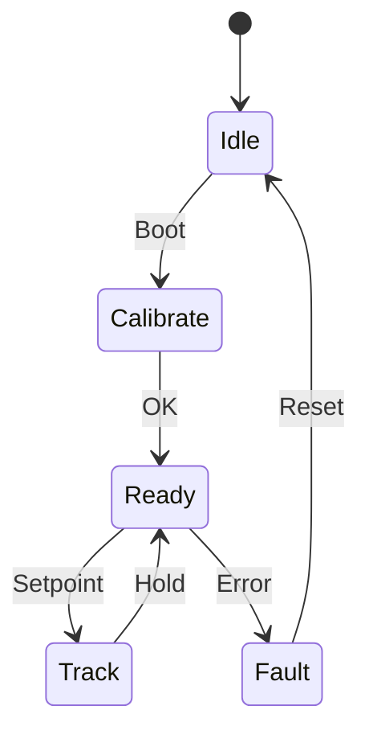

# Rotating Arm Assembly Spec

## Purpose
Enable continuous arm rotation with precise angle control under thrust loads.

## Scope
Servos, encoders, geartrain, wiring path, slip-rings on DC side, thermal.

## Functional requirements
- Continuous rotation; target speed ≥ 2.0 rev/s no-load; stall torque ≥ 0.5 N·m at arm
- Angle control accuracy ≤ 0.5° RMS; latency ≤ 20 ms
- Backlash ≤ 0.5°; torsional stiffness ≥ 0.3 N·m/deg

## Non-functional requirements
- Mass ≤ 120 g per arm module; maintainability; IP54

## Interfaces
- Mechanical: mount 23×12×28 mm servo class; shaft Ø per design; dual bearings
- Electrical: motor power 24 V; servo driver power 5–12 V; encoder I2C/SPI
- Data: angle, velocity, temperature, status via CAN

## State machine

## Data model
- angle_rad, angle_vel, torque_est, temp_c, status

## Acceptance tests
- Step response with prop thrust (~12 N): overshoot < 2%; rise < 150 ms
- Frequency response: bode plots across amplitudes; velocity saturation characterization
- Thermal soak: 30 min at 50% duty within temp limits
- Endurance: ≥ 100k revolutions without slip-ring failure

## Risks
- Brush wear; EMI; encoder drift; heating

## Open questions
- Driver choice; lubrication schedule; shielding

## Versioning
- v0.2 detailed spec
