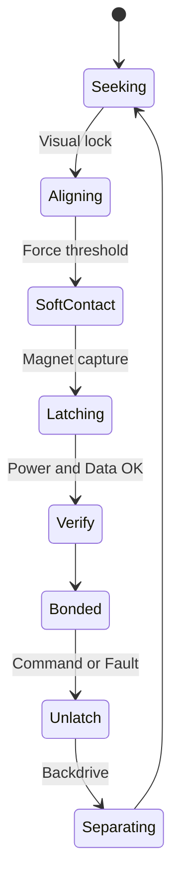

# Docking Interface Spec

↑ [Docs index](../README.md)

Reliable mid-air and perch docking for mechanical, power, and data coupling between units and to ground infrastructure.

---

## Scope

- **In scope**: Connector geometry, latch, pogo pinout, power handover, data PHY/protocol, state machine, acceptance criteria.
- **Out of scope**: Docking *perception* (see [perception/docking.md](../perception/docking.md)), formation planning, recharge scheduling (see [power/bus_and_sharing.md](../power/bus_and_sharing.md)), safety envelopes (see [safety/safety_case.md](../safety/safety_case.md)).

---

## Purpose and requirements

| Requirement | Target |
|-------------|--------|
| Misalignment tolerance (soft-contact) | ±6 mm lateral, ±5° angular |
| Retention force | ≥ 3× unit mass equivalent |
| Emergency release | ≤ 200 ms from command to separation |
| Cycle life | ≥ 10k dock/undock cycles |
| Environmental (when docked) | IP54; salt fog and dust tolerance |

---

## Mechanical

- **Alignment**: Dual-cone with chamfered pins; lead-ins sized for ±6 mm capture.
- **Latch**: Magnet-assisted spring latch; secondary lock via cam; manual release tool.
- **Materials**: Stainless pins, hard anodized cones; low-friction inserts; replaceable wear parts.
- **Tolerances**: Mating clearance 0.2–0.5 mm; flatness ≤ 0.1 mm.

### Interface envelope (target)

| Dimension | Value | Notes |
|-----------|--------|-------|
| Mating face | 40 mm × 40 mm (nominal) | Excludes lead-in chamfer |
| Cone depth | 8–12 mm | Full engagement |
| Pin protrusion | 1.5–2.0 mm | Pre-load for contact wipe |

*(Refine in CAD; see `hardware/CAD/docking/`.)*

---

## Electrical (power)

### Pinout

| Pin group | Count | Function | Rating |
|-----------|-------|----------|--------|
| Power | 2 | VBAT+ | ≥ 15 A per pin |
| Ground | 2 | VBAT−, chassis | Same |
| Sense | 2 | Pre-charge sense, presence | Signal level |
| Data reserve | 2 | Future / spare | TBD |

- **Contact resistance**: < 10 mΩ per power/ground contact.
- **Inrush**: Pre-charge via 100–330 Ω; contact wipe length ≥ 1.0 mm before main current.
- **Protection**: Reverse polarity keying (mechanical); TVS on power rails; ideal diode ORing for bus sharing.
- **EMI**: Common-mode choke on power lines at connector; optional ferrite bead; keep high‑di/dt loops small.

---

## Data

- **Option A**: CAN 2.0B 500 kbps; bus segmentation per aggregate; termination per segment.
- **Option B**: 100BASE-T1 single-pair Ethernet; transformer coupling; auto-negotiation.
- **Discovery**: Attach event triggers address request; keep-alives at 10–50 Hz.
- **CRC and retries**: CAN: 15-bit CRC per frame; retransmit on NACK/error; application-layer ack for critical commands. Ethernet: FCS; TCP or application-level ack for reliability.
- **Bandwidth budget (Option A, 500 kbps)**: Control/telemetry ~80%; discovery and diagnostics ~15%; margin ~5%. Max sustained payload ~40 kbps per logical channel to leave headroom.

---

## State machine

### Thresholds and timeouts

| Transition | Condition | Timeout / limit |
|------------|-----------|------------------|
| Seeking → Aligning | Visual/beacon lock (see [perception/docking](../perception/docking.md)) | — |
| Aligning → SoftContact | Force/IMU threshold or current spike | 5 s max in Aligning |
| SoftContact → Latching | Magnet energize; mechanical capture | 500 ms |
| Latching → Verify | Power rails within spec; data link up | 50 ms |
| Verify → Bonded | Voltage stable; keep-alive received | 100 ms |
| Bonded → Unlatch | Command or fault (e.g. loss of keep-alive) | — |
| Unlatch → Separating | Latch released; backdrive/repulse | 200 ms to separation |

### Recovery and fault codes

- **Stuck in Aligning**: Timeout → return to Seeking; log fault code `DOCK_ALIGN_TIMEOUT`.
- **Verify failed**: Power or data not OK within 50 ms → Unlatch, retry or abort; `DOCK_VERIFY_FAIL`.
- **Bonded → link loss**: After N missed keep-alives (e.g. N=3), treat as fault; initiate safe Unlatch; `DOCK_LINK_LOST`.
- **Emergency release**: Command or hardware E-stop; bypass normal sequence; Unlatch within 200 ms; `DOCK_EMERGENCY`.

*(Fault codes to be defined in `msgs/docking` or equivalent; see [compute/ros2_msgs](../compute/ros2_msgs.md).)*

---

## Sensing and thresholds

- Force/IMU bump detection; current spike for contact.
- Voltage and comm checks within 50 ms of Latching (see state machine table).

---

## Tests

| Category | Test |
|----------|------|
| Environmental | Capture under wind ≤ 5 m/s; vibration; dust contamination |
| Endurance | Hot-plug cycles 10k; salt fog 48 h; thermal cycling −10↔55 °C |
| Functional | State machine transitions; timeout and recovery; emergency release timing |
| Acceptance | Per latch: retention force; contact resistance; data link at 10k cycle |

---

## Risks

- Wear and contamination → replaceable wear parts; periodic inspection.
- Intermittent contacts → redundant pins; monitoring and fault codes.
- Arcing → pre-charge; mate sequence; TVS.

---

## Related docs

- [Perception: docking](../perception/docking.md) — sensors and pose for alignment
- [Power: bus and sharing](../power/bus_and_sharing.md) — power handover and ORing
- [Safety case](../safety/safety_case.md) — hazards and mitigations
- [ROS 2 msgs](../compute/ros2_msgs.md) — docking state/telemetry messages

---

## Open questions

- Final data PHY choice (CAN vs 100BASE-T1).
- Pogo plating: Au thickness vs cost and cycle life.

---

## Changelog

| Version | Date | Change |
|---------|------|--------|
| 0.2 | (draft) | Detailed spec: pinout, state machine thresholds, data CRC/bandwidth, EMI, related docs |
| 0.1 | — | Initial mechanical, electrical, data, state machine outline |
