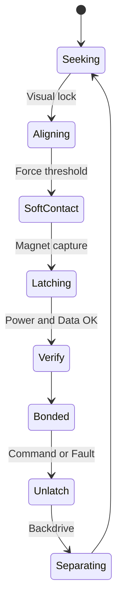

# Docking Interface Spec

## Purpose
Reliable mid-air and perch docking for mechanical, power, and data coupling.

## Requirements
- Misalignment tolerance: ±6 mm lateral, ±5° angular at soft-contact
- Retention force: ≥ 3× unit mass equivalent; emergency release within 200 ms
- Cycle life: ≥ 10k dock/undock cycles
- Environmental: IP54 when docked; salt fog and dust tolerance

## Mechanical
- Alignment: dual-cone with chamfered pins; lead-ins sized for ±6 mm capture
- Latch: magnet-assisted spring latch; secondary lock via cam; manual release tool
- Materials: stainless pins, hard anodized cones; low-friction inserts; replaceable wear parts
- Tolerances: mating clearance 0.2–0.5 mm; flatness ≤ 0.1 mm

## Electrical (power)
- Pogo pin array: 2× power, 2× ground, 2× sense, 2× data reserve
- Ratings: ≥ 15 A per power pin; low resistance < 10 mΩ per contact
- Inrush: pre-charge with 100–330 Ω; contact wipe length ≥ 1.0 mm
- Protection: reverse polarity keying; TVS on power; ideal diode ORing

## Data
- Option A: CAN 2.0B 500 kbps; bus segmentation per aggregate
- Option B: 100BASE-T1 single-pair Ethernet; transformer coupling
- Discovery: attach event triggers address request; keep-alives at 10–50 Hz

## State machine

## Sensing and thresholds
- Force/IMU bump detection; current spike for contact
- Voltage and comm checks within 50 ms of Latching

## Tests
- Capture under wind (≤ 5 m/s); vibration; contamination with dust
- Hot-plug cycles 10k; salt fog 48 h; thermal cycling −10↔55 °C

## Risks
- Wear and contamination; intermittent contacts; arcing

## Open questions
- Final data PHY choice; pogo plating selection (Au thickness)

## Versioning
- v0.2 detailed spec
