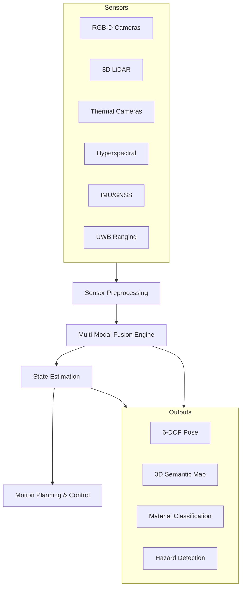

# Multi-Modal Perception and Localization Architecture

Comprehensive perception stack for MosaicDrone swarms operating in complex environments including landfills, industrial sites, and indoor/outdoor mixed scenarios.

---

## System Overview



---

## Sensor Suite Configuration

### Core Localization Sensors

#### Indoor Configuration
```yaml
primary_sensors:
  imu:
    model: ICM-42688-P
    rate: 1000 Hz
    noise: {gyro: 0.1°/s, accel: 0.02 m/s²}
    bias_stability: {gyro: 2°/h, accel: 0.1 mg}
  
  cameras:
    stereo_pair:
      model: OAK-D-Pro
      resolution: 1280x720
      fps: 30
      baseline: 75mm
      fov: 81° diagonal
      sync_accuracy: <1ms
  
  uwb_ranging:
    model: DWM3000
    range: 0.1-200m
    accuracy: ±10cm (95%)
    update_rate: 20 Hz
    anchor_network: minimum 4 fixed

optional_sensors:
  mocap_markers:
    type: retroreflective_spheres
    diameter: 14mm
    tracking_volume: site_dependent
    accuracy: <1mm position, <0.1° orientation
```

#### Outdoor Configuration
```yaml
primary_sensors:
  gnss_rtk:
    model: ZED-F9P
    constellations: [GPS, GLONASS, Galileo, BeiDou]
    rtk_accuracy: <2cm horizontal, <4cm vertical
    update_rate: 20 Hz
    correction_source: NTRIP or base_station
  
  imu: # Same as indoor
  cameras: # Same as indoor
  
  lidar_3d:
    model: Velodyne VLP-16 or Ouster OS1-32
    range: 100m
    accuracy: ±3cm
    angular_resolution: 0.1-0.4°
    points_per_second: 300k-650k
```

### Perception Sensors (Material Classification & Hazard Detection)

#### Spectral Analysis
```yaml
hyperspectral_camera:
  model: Specim FX17
  spectral_range: 400-1000 nm
  spectral_resolution: 5.5 nm
  spatial_resolution: 1280x1024
  integration_time: 1-100 ms
  applications: [plastic_identification, metal_detection, contamination_assessment]

thermal_camera:
  model: FLIR Boson 640
  spectral_range: 7.5-13.5 μm
  resolution: 640x512
  accuracy: ±5°C or 5%
  frame_rate: 60 fps
  applications: [hotspot_detection, methane_visualization, process_monitoring]
```

---

## Multi-Modal Fusion Architecture

### State Estimation Pipeline

#### Extended Kalman Filter (EKF) Implementation
```yaml
state_vector: [px, py, pz, vx, vy, vz, qw, qx, qy, qz, bax, bay, baz, bgx, bgy, bgz]
# Position, velocity, quaternion orientation, accel/gyro biases

prediction_model:
  imu_integration: quaternion_based
  process_noise: 
    position: 0.01 m²/s³
    velocity: 0.1 m²/s³  
    orientation: 0.001 rad²/s
    bias_drift: 1e-6 (m/s²)²/s for accel, 1e-8 (rad/s)²/s for gyro

update_models:
  visual_odometry:
    measurement: [Δx, Δy, Δz, Δroll, Δpitch, Δyaw]
    noise_model: adaptive_based_on_feature_quality
    outlier_rejection: RANSAC + Mahalanobis_distance
  
  uwb_ranging:
    measurement: distance_to_anchors
    noise_model: range_dependent (σ = 0.1 + 0.001*range)
    multipath_mitigation: first_path_detection
  
  gnss_rtk:
    measurement: [lat, lon, alt]
    noise_model: fix_quality_dependent
    coordinate_transform: ECEF_to_local_NED
```

### Cooperative Localization

#### Inter-Agent Ranging and Pose Sharing
```yaml
cooperative_constraints:
  relative_ranging:
    uwb_inter_agent: 20 Hz updates
    visual_detection: ArUco markers at 10 Hz
    lidar_registration: ICP alignment when in range
  
  pose_graph_sharing:
    protocol: DDS with QoS reliability
    frequency: 5 Hz for pose, 1 Hz for map updates  
    conflict_resolution: consensus_based_on_confidence
    
  distributed_optimization:
    algorithm: distributed_pose_graph_optimization
    convergence_criteria: <1cm position change per iteration
    max_iterations: 10
    communication_rounds: 3
```

---

## Material Classification Pipeline

### Multi-Spectral Analysis

#### Plastic Identification
```yaml
spectral_signatures:
  pet_bottles:
    key_peaks: [850nm, 970nm, 1215nm]
    classification_confidence: >90%
    contamination_tolerance: <5% by_area
  
  hdpe_containers:
    key_peaks: [930nm, 1180nm, 1395nm]  
    classification_confidence: >85%
    mixed_polymer_detection: spectral_deconvolution
  
  pvc_pipes:
    key_peaks: [610nm, 1430nm, 1730nm]
    health_hazard_flag: true
    special_handling: isolation_required

metal_detection:
  magnetic_susceptibility:
    ferrous_threshold: >0.001 SI_units
    measurement_method: inductive_sensor
  
  spectral_reflectance:
    aluminum: high_reflectance_650-900nm
    copper: characteristic_absorption_600nm
    stainless: low_magnetic + spectral_pattern
```

#### Contamination Assessment
```yaml
contamination_detection:
  organic_matter:
    method: fluorescence_imaging
    excitation: 365nm_UV
    detection: 400-700nm_visible
    threshold: >2%_coverage_area
  
  chemical_residues:
    method: raman_spectroscopy
    spot_sampling: 1_per_10cm²
    hazardous_compounds: [pcb, heavy_metals, solvents]
    action_limit: any_detection_above_background
  
  moisture_content:
    method: near_infrared_absorption
    wavelength: 1450nm_water_peak
    accuracy: ±0.5%_moisture_content
    real_time: continuous_monitoring
```

---

## Hazard Detection Systems

### Environmental Monitoring

#### Gas Detection
```yaml
methane_detection:
  sensor_type: tunable_diode_laser_spectroscopy
  detection_limit: 1 ppm
  response_time: <2 seconds
  coverage: continuous_path_monitoring
  action_threshold: 25%_LEL (1.25%_vol)
  
hydrogen_sulfide:
  sensor_type: electrochemical
  detection_range: 0-100 ppm
  accuracy: ±2 ppm
  action_threshold: 10 ppm (immediate_area_evacuation)

volatile_organics:
  sensor_type: photoionization_detector
  detection_range: 0.1-2000 ppm
  compounds: [benzene, toluene, xylene]
  action_threshold: 50 ppm_total_voc
```

#### Structural Hazards
```yaml
instability_detection:
  method: lidar_change_detection
  baseline_scan: daily_reference
  change_threshold: >5cm_displacement
  monitoring_frequency: continuous_during_operations
  
ground_penetrating_radar:
  frequency: 400-900 MHz
  penetration_depth: 1-3 meters
  resolution: 5cm_vertical, 10cm_horizontal
  applications: [void_detection, buried_objects, soil_density]

thermal_monitoring:
  hotspot_detection:
    threshold: >60°C_above_ambient
    spatial_resolution: 0.5m²_minimum_detectable
    temporal_monitoring: continuous
  
  combustion_risk:
    indicators: [temperature_gradient, gas_concentration, moisture]
    risk_model: fuzzy_logic_based
    alert_levels: [low, medium, high, critical]
```

---

## Real-Time Processing and Communication

### Computational Architecture

#### Edge Processing
```yaml
onboard_processing:
  compute_platform: NVIDIA_Jetson_AGX_Orin
  processing_allocation:
    sensor_preprocessing: 20%_GPU
    visual_odometry: 30%_GPU  
    material_classification: 35%_GPU
    communication: 10%_CPU
    system_overhead: 5%_margin

latency_requirements:
  localization_update: <20ms
  hazard_detection: <100ms  
  material_classification: <500ms
  map_update: <1s
```

#### Distributed Processing
```yaml
swarm_coordination:
  task_allocation:
    sensing_roles: dynamic_based_on_capability
    processing_distribution: load_balancing
    redundancy: 2x_coverage_for_critical_functions
  
  data_sharing:
    raw_sensor: minimal (bandwidth_limited)
    processed_features: medium_priority
    map_updates: high_priority
    hazard_alerts: emergency_priority

communication_protocols:
  local_mesh: 802.11s_mesh_networking
  long_range: 4G/5G_cellular_backup
  emergency: 915MHz_LoRa_for_safety_critical
```

---

## Integration Points

### ROS 2 Interface
```yaml
published_topics:
  /perception/pose: geometry_msgs/PoseWithCovarianceStamped
  /perception/map: nav_msgs/OccupancyGrid + custom_material_layer
  /perception/hazards: custom_msgs/HazardArray
  /perception/materials: custom_msgs/MaterialClassification

subscribed_topics:
  /sensors/imu: sensor_msgs/Imu
  /sensors/camera/left: sensor_msgs/Image
  /sensors/camera/right: sensor_msgs/Image  
  /sensors/lidar: sensor_msgs/PointCloud2
  /sensors/thermal: sensor_msgs/Image

service_interfaces:
  /perception/relocalize: trigger_relocalization
  /perception/set_roi: define_region_of_interest
  /perception/get_material_info: query_material_properties
```

---

## Versioning and Future Development

- v0.3: Multi-modal fusion with material classification
- v0.4: Cooperative localization and distributed mapping  
- v0.5: Advanced hazard detection and predictive modeling
- Future: ML-based adaptive sensing and autonomous exploration strategies
